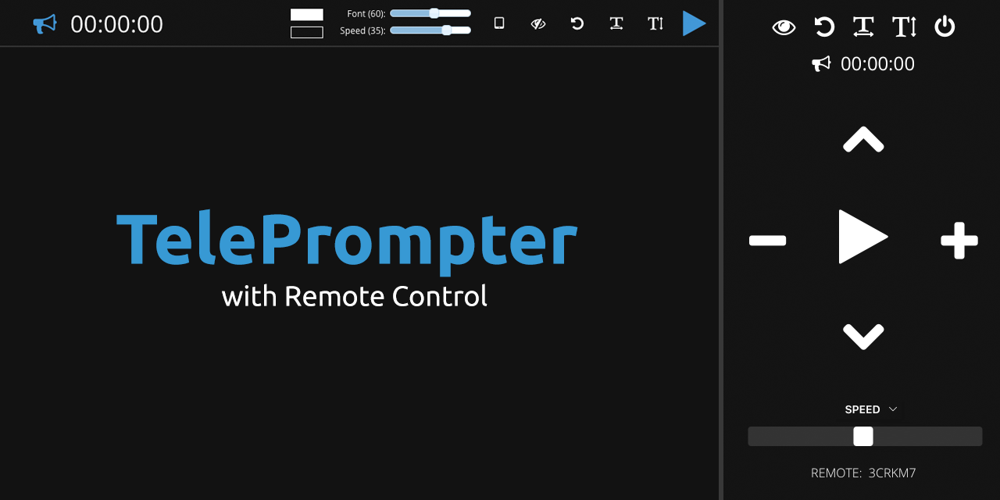

TelePrompter
===

> Browser-based TelePrompter with Remote Control

Features
---

- [X] Edit Text in Browser
- [X] Changes Saved Automatically
- [X] Handy Keyboard Shortcuts
- [X] Advanced Controls
- [X] Remote Control Support

Keyboard Shortcuts
---

Key              | Alternatives                            | Description
:---------------:|:---------------------------------------:|:--------------------------
<kbd>↑</kbd>     |                                         | Increase Font Size
<kbd>↓</kbd>     |                                         | Decrease Font Size
<kbd>←</kbd>     | <kbd>PAGE UP</kbd>                      | Slow Down Teleprompter
<kbd>→</kbd>     | <kbd>PAGE DOWN</kbd>                    | Speed Up Teleprompter
<kbd>SPACE</kbd> | <kbd>B</kbd> <kbd>F5</kbd> <kbd>.</kbd> | Start / Stop Teleprompter
<kbd>ESC</kbd>   |                                         | Resets GUI

We also made an effort to make sure your text will be easy to read.   So if you are pasting text from a word document, we'll do some cleaning up to make the breaks flow more easily.

# Everything down below is from the Developer, please check it out:
Get Updates
---

Follow this project on GitHub, or you can follow me on Twitter for updates: **[@mrmidi](http://twitter.com/mrmidi "Follow @mrmidi on Twitter")**

#### Do you use this TelePrompter? 

[Buy a Coffee for the developer manifestinteractive](https://github.com/manifestinteractive/teleprompter)
